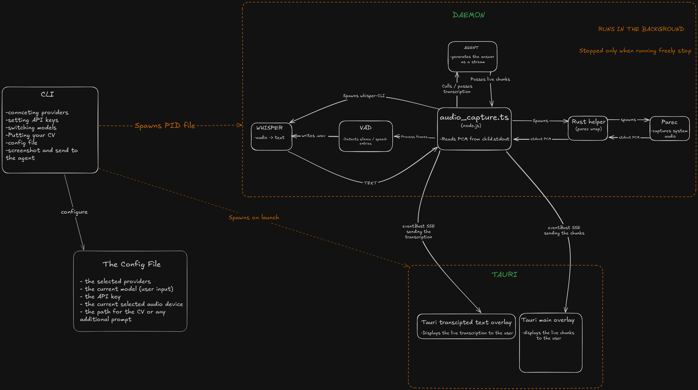

# Freely

**Your AI screen assistant — local, private, free. The open-source alternative to Cluely.**

> Cluely charges $150/month. Freely runs on your machine, uses your own API key, and costs pennies.

---

## Badges

<!-- TODO: Add badges -->
<!-- npm version: https://img.shields.io/npm/v/freely -->
<!-- License: https://img.shields.io/npm/l/freely -->
<!-- Platform: Linux | Windows | macOS -->

---

## Demo

<!-- TODO: Add a GIF or screenshot showing both windows (overlay + transcript panel) in action -->
<!-- This is the single highest-impact addition you can make before launch -->

---

## What is Freely?

Freely is a **real-time AI conversation assistant** that lives in your terminal and desktop overlay. It listens to meetings, interviews, or calls through your microphone and whispers the perfect response directly onto your screen — without anyone else knowing.

Unlike Cluely, everything runs **locally on your machine**:
- Audio capture and voice activity detection stay on-device
- Speech-to-text runs via a local Whisper model
- Your conversation never touches a third-party server unless you choose a cloud AI provider for the LLM

**Who is it for?** Developers, remote workers, interview candidates, neurodivergent professionals — anyone who wants a real-time AI co-pilot in conversations without paying $150/month or sending raw audio to the cloud.

---

## Features

- **Real-time transcription** — local Whisper STT, no cloud dependency for speech-to-text
- **Multi-provider AI** — supports Gemini, Anthropic (Claude), and OpenAI — use whichever model you prefer
- **Screen capture exclusion** — the overlay window is automatically excluded from screenshots and screen recordings (Windows)
- **Background context injection** — drop your CV or background info and the AI tailors responses accordingly
- **Voice-triggered responses** — two-second pause triggers the AI to suggest what to say next
- **Dual-window overlay** — a compact floating bar shows AI responses; a side panel shows the live transcript
- **Hotkey / CLI triggers** — `freely ask`, `freely screenshot` — send questions from the terminal to the overlay
- **Privacy-first** — no account, no cloud sync, no audio leaves your machine (unless you use a cloud LLM)
- **Cross-platform** — Linux (primary), Windows. (future macOS)

---

## Installation

```bash
npm install -g freely
```

### Prerequisites

**Linux:**
- PulseAudio or PipeWire (with `pactl` and `parec` available)
- `spectacle` (KDE screenshot tool) — optional, only if you use `/screenshot`
- A local Whisper binary (`whisper-cli`) — place it in your `PATH` or configure the path in the daemon
- `node` >= 18

**Windows:**
- Supported but less tested. The overlay uses Webview2 (bundled with Windows 10+).
- Ensure `npm` and `node` >= 18 are installed.

**macOS:**
- Not yet implemented. Contributions welcome.

After installation, build the overlay:

```bash
cd overlay && npm run tauri build
```

The built AppImage (`freely-x86_64.AppImage`) will be placed in `bin/`.

---

## Quick Start

```bash
freely
```

On first run, Freely will guide you through:
1. Selecting an audio source (your microphone)
2. Setting up an AI provider (API key + model)
3. (Optional) Providing your CV or background context

Once configured, three things happen:

```
┌─────────────────────────────────────┐
│  Daemon starts (background process) │
│  Overlay window appears (top-right) │
│  Transcript panel opens (left side) │
└─────────────────────────────────────┘
```

The daemon listens for speech. When someone speaks, you'll see the live transcript appear in the side panel. After a two-second pause, the AI generates a suggested response and displays it in the floating overlay.

### CLI Commands

| Command | Description |
|---------|-------------|
| `freely` | Interactive chat mode |
| `freely daemon` | Start the background daemon (without interactive CLI) |
| `freely ask <question>` | Send a question to the daemon (shown in the overlay) |
| `freely screenshot [question]` | Take a screenshot and send it to the AI |
| `freely stop` | Stop the background daemon and close the overlay |
| `freely config show` | Display current configuration |
| `freely config edit` | Open config in `$EDITOR` |

---

## Configuration

Config is stored at `~/.config/freely/config.json`:

```json
{
  "device": "alsa_input.pci-0000_00_1f.3.analog-stereo",
  "provider": "gemini",
  "apiKey": "YOUR_API_KEY",
  "model": "gemini-2.0-flash"
}
```

| Field | Description |
|-------|-------------|
| `device` | Audio source to monitor (listed on first run) |
| `provider` | AI provider: `gemini`, `anthropic`, or `openai` |
| `apiKey` | Your API key for the chosen provider |
| `model` | Model name (e.g. `gemini-2.0-flash`, `claude-3-5-sonnet-latest`, `gpt-4o`) |

### Background Context (CV)

Drop a `cv.txt` or `cv.pdf` in `~/.config/freely/` and the AI will inject that context into every response — useful for interview prep, meeting context, or role-specific assistance.

---

## Supported Platforms

| Platform | Status | Notes |
|----------|--------|-------|
| **Linux** | ✅ Primary | Tested on Arch (KDE) with PulseAudio/PipeWire |
| **Windows** | 🟡 Beta | Capture exclusion works; audio capture and overlay need more testing |
| **macOS** | ❌ Planned |  Contributions welcome |

---

## Privacy & Data Flow

Freely is designed to be **private by default**. Here's exactly what happens with your data:

| Stage | Where it runs | Data leaves your machine? |
|-------|---------------|--------------------------|
| Audio capture | Local (Rust binary via `parec`) | ❌ No |
| Voice Activity Detection | Local (Node.js, RMS-based VAD) | ❌ No |
| Speech-to-Text | Local (Whisper CLI) | ❌ No |
| LLM inference | Cloud (Gemini / Claude / OpenAI API) | ✅ Yes — transcribed text only |
| Screenshot analysis | Cloud (same providers) | ✅ Yes — image + text |

**What the AI provider sees:** Transcribed text (never raw audio) and optionally screenshots, sent to whichever API provider you configure.

**What stays local:** Raw audio, voice activity, transcripts (unless you reuse them), your config file, and your CV.

You can further reduce data sharing by running a local LLM. Freely's provider abstraction makes it straightforward to add one — PRs welcome.

---

## Architecture


- **Daemon** — Node.js background process. Manages audio capture (Rust helper), VAD, Whisper transcription, AI provider calls, and an SSE server on port 3001.
- **Overlay** — Tauri v2 app (Rust + vanilla TypeScript). Two transparent, always-on-top windows: a small floating bar and a transcript panel. Connects to the daemon's SSE stream.
- **Audio Capture Helper** — Rust binary that captures audio via `parec`, performs silence detection, and streams PCM data to the daemon.
- **Interactive CLI** — Ink-based React terminal UI for direct chat with the AI.

---

## Contributing

Issues and pull requests are welcome. For major changes, please open an issue first to discuss what you'd like to change.

- **Report bugs** — file an issue with your platform, config, and steps to reproduce
- **Feature requests** — open a discussion or issue
- **PRs** — fork, branch, commit, and open a pull request

<!-- TODO: Link to CONTRIBUTING.md if/when created -->

---

## License

MIT — see [LICENSE](./LICENSE) for details.

---

*Built because $150/month for a speech-to-text wrapper is absurd.*
